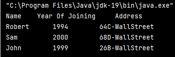

# Java-Ex-05
### Write a program that would print the information (name, year of joining, salary, address) of three employees by creating a class named 'Employee'. 
#### The output should be as follows:
#### Name           Year of joining              Address
#### Robert                1994                  64C- WallsStreat
#### Sam                   2000                  68D- WallsStreat
#### John                  1999                  26B- WallsStreat
## Aim:
To write a Java program to create an object outside the main class.

Algorithm
### Step 1 : 
Open Intelli J application or any other code editor.

### Step 2 : 
Create a class called "Employee" and create required statements.

### Step 3 : 
Create a main class,called the "Solution".

### Step 4 : 
Using Object creation call the method in "Employee" class.

### Step 5 : 
Display the statements from the first Class using Solution Class in the terminal.

## Program :-
```java
public class Employee
{
    public void display(){
    System.out.println("Name"+"\t"+"Year Of Joining"+"\t\t"+"Address");
    }
    public void employee(String name,int year,String Sal,String address)
    {
        System.out.println(name+"\t\t"+year+"\t\t"+address);

    }
}
public class Solution {
    public static void main(String[] args)
    {
        Employee emp1=new Employee();
        Employee emp2=new Employee();
        Employee emp3=new Employee();
        emp1.display();
        emp1.employee("Robert",1994,"50k","64C-WallStreet");
        emp2.employee("Sam  ",2000,"50k","68D-WallStreet");
        emp3.employee("John",1999,"50k","26B-WallStreet");
    }
}
```
## Output

## Result
We have successfully created a Java program to create an object outside the main class.